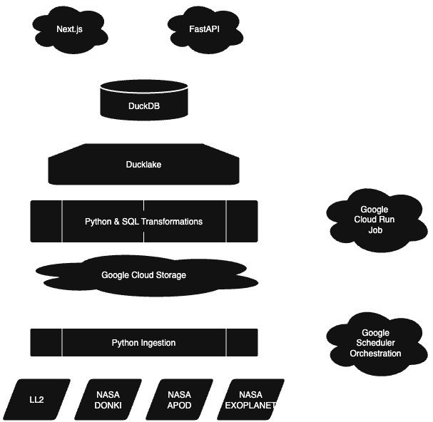

# Orbital

Orbital, simplifying the astronomical.

An end-to-end data engineering capstone that demonstrates a modern data lakehouse pipeline using lightweight, file-based tooling with DuckDB and DuckLake to produce a production-capable data product.

## Table of contents

- [Deployment Links](#deployment-links)
- [Overview](#overview)
- [Features](#features)
- [Data Sources](#data-sources)
- [Architecture](#architecture)
- [Core technologies](#core-technologies)
- [Data Schemas](#data-schemas)
- [Running the project locally](#running-the-project-locally)

## Deployment Links

 - [Orbital Client](https://orbital-client-941477901286.us-central1.run.app/)
 - [API Deployment Docs](https://orbital-api-941477901286.us-central1.run.app/docs)
 - [Orbital Client Codebase](https://github.com/MichaelGalo/Orbital-Client)
 - [API Codebase](https://github.com/MichaelGalo/Orbital-API)

## Overview

This project is a production-minded capstone that ingests public datasets related to Space Exploration, validates and standardizes them, and exposes clean, analysis/web-ready datasets for downstream use. The primary goals are:

- Demonstrate a modern lakehouse data architecture and medallion ELT patterns
- Use fast, in-memory analytical engines (DuckDB + DuckLake) for exploration and testing
- Provide repeatable pipelines and clear data quality checks that update automatically each day
- Produce datasets that are ready for analytics, visualization, and/or loading into a cloud warehouse
- Create clean, reusable code for future endeavors
- Deploy a cloud-native, micro-services architecture to display a real-world use case

The repository contains pipeline scripts, utilities, orchestration, API, and when run, a catalog of datasets arranged into raw, staged, and cleaned layers in Google Cloud Storage.

## Data Sources

- Astronaut Data: The Space Devs Launch Library 2 API
- Exoplanet Data: Astroquery SDK (Community maintained access to NASA's Exoplanet Database)
- Space Weather Notifications: NASA DONKI (Database of Notifications, Knowledge and Information) API
- Hero Image: NASA APOD (Astronomy Picture of the Day) API

## Features

- Google Cloud Storage (GCS) data lake for object storage
- Layered medallion catalog architecture (Raw → Staged → Clean)
- File-based analytics using DuckDB and DuckLake for fast queries
- Lightweight pipeline scripts for ingestion, quality checks, and lakehouse catalog sync
- REST API programmatic data access for serving cleaned data
- Data Quality Tests with custom Python & SQL
- Unit tests with pytest and structured logging
- Orchestration for daily updated data

## Architecture



## Tech Stack

| Category | Technology | Purpose |
|----------|------------|---------|
| **Object Storage** |  | Cloud-based storage for raw, staged, and cleaned data |
| **Data Lakehouse** |  | Data lakehouse Catalog |
| **Database Operations** |  | Analytical database for operations and querying |
| **Programming & Utilities** |  | Data ingestion, utilities, and scripting |
| **Data Transformation** |  | SQL-based transformations|
| **Data Processing** |  | DataFrame manipulation |
| **Testing** |  | Automated testing |
| **Data Quality** |  | Data quality checks using SQL |
| **Orchestration** |  | Workflow automation and scheduling |
| **CI/CD** |  | Continuous integration and deployment |
| **Data Access** |  | Programmatic Data Access & Documentation
| **Data Visualization** |  | Web client for data access and visualization |
| **Deployment** |  | Cloud Run–based deployment of services |

## Data Schemas

This project follows a medallion architecture with three primary layers:

- Raw (Bronze)
   - Immutable ingested data as originally fetched from APIs that are time-stamped
   - Stored in GCS in `/RAW_DATA/`
    - Ducklake Catalog .parquet files stored in `CATALOG_DATA_SNAPSHOTS/RAW_DATA/`

- Staged (Silver)
   - Standardized and validated records, ready for transformation
   - Ducklake Catalog .parquet files stored in `CATALOG_DATA_SNAPSHOTS/STAGED/`

- Cleaned (Gold)
   - Business-ready, deduplicated tables suitable for analytics or web services
   - Ducklake Catalog .parquet files stored in `CATALOG_DATA_SNAPSHOTS/CLEANED/`

Typical flow: ingest -> store -> standardize/transform -> quality test -> clean -> serve

## Running the Project Locally

1. **Clone the repository**:
   ```bash
   git clone https://github.com/MichaelGalo/Orbital-Data-Pipeline.git
   cd your-repo
   ```

2. **Set up a virtual environment**:
   ```bash
   uv init
   uv sync
   ```

3. **Set up your Google Cloud Storage**:
- Add environmental variables that will connect your GCS after creating a storage permissions service account.
    ```bash
    GCP_BUCKET_NAME=your-bucket-name
    GCP_PROJECT_NAME=project-name-id
    GCP_ACCESS_KEY=your-access-key
    GCP_SECRET_KEY=your-secret-key
    GCP_ENDPOINT_URL=storage.googleapis.com
    ```

4. **Ensure other .env variables are present for URL endpoints & API keys**

5. **Run the Prefect flow**:
   ```bash
   uv run -m src.runner
   ```

6. **Start the FastAPI server**:
   ```bash
   fastapi dev api/app.py
   ```

7. **View Data Visualization Dashboard**:
   ```bash
   streamlit run data-vis/app.py
   ```